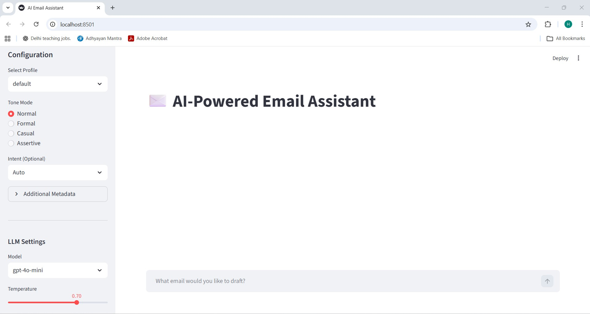
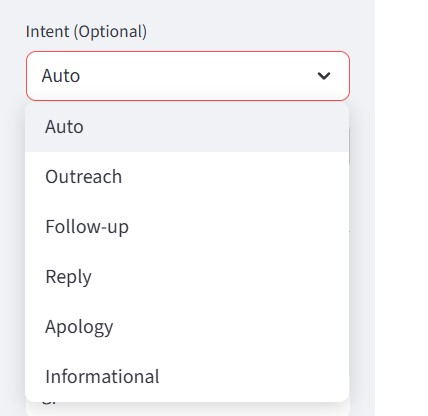
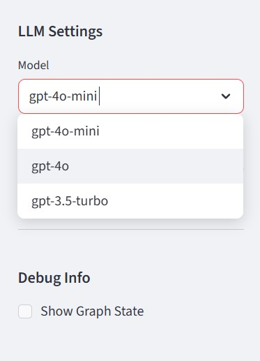
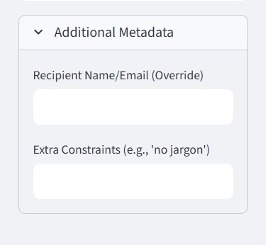

# ✉️ AI-Powered Email Assistant

A sophisticated, multi-agent AI system designed to draft, refine, and personalize emails based on your unique style and context. Built with **LangGraph**, **LangChain**, and **Streamlit**.

## 🚀 App Screenshot


### 🚀 App Features Screenshots
---
#### Intent Detection : Manually specify if it's an Outreach, Follow-up, Apology, etc.
 
#### Multi LLM Choice : Switch between `gpt-4o`, `gpt-4o-mini`, etc. directly from the UI.

#### Additional Metadata : Add recipient mail and extra constraints



## 🌟 Key Features

-   **Multi-Agent Architecture**: 6 specialized agents work together to parse, plan, write, and review your emails.
-   **Personalization & Learning**: The system learns from your edits over time, adapting to your style (saved in `email_history.json`).
-   **Dynamic Configuration**:
    -   **LLM Model**: Switch between `gpt-4o`, `gpt-4o-mini`, etc. directly from the UI.
    -   **Temperature**: Control creativity vs. precision.
-   **Advanced UI**:
    -   **Tone Selector**: Formal, Casual, Assertive, or Normal.
    -   **Intent Override**: Manually specify if it's an Outreach, Follow-up, Apology, etc.
    -   **Real-time Visualization**: Watch the agents "think" and process your request step-by-step.
    -   **Editor**: Fully editable draft with **PDF Export** and **Save to History** capabilities.
-   **Quality Control**: Automated "Reviewer" agent that rejects and retries bad drafts before showing them to you.

## 📂 Project Structure

```
hima_AI_EmailAssitant/
├── src/
│   ├── agents/                 # specialized AI agents
│   │   ├── input_parser.py     # Extracts topic, recipient, constraints
│   │   ├── intent_detector.py  # Classifies email purpose
│   │   ├── personalization.py  # Injects user bio and history
│   │   ├── tone_stylist.py     # Generates style instructions
│   │   ├── draft_writer.py     # Writes the actual email
│   │   └── reviewer.py         # Validates quality (grammar, tone)
│   ├── core/
│   │   ├── graph.py            # LangGraph workflow definition (edges, retry logic)
│   │   └── state.py            # Shared state schema (AgentState)
│   ├── data/
│   │   ├── user_profiles.json  # User profiles (name, bio, signatures)
│   │   └── email_history.json  # Learned history from your edits
│   ├── ui/
│   │   └── app.py              # Streamlit Web Interface
│   └── utils/
│       ├── llm.py              # LLM initialization utility
│       └── learning.py         # History management utility
├── .env                        # API keys (OPENAI_API_KEY)
└── verification_*.py           # Test scripts
```

## 🚀 Setup & Installation

### Prerequisites
-   Python 3.10+
-   An OpenAI API Key

### Installation

1.  **Clone the repository**:
    ```bash
    git clone https://github.com/ehimshr/hima_AI_EmailAssitant.git
    cd hima_AI_EmailAssitant
    ```

2.  **Create a Virtual Environment** (Recommended):
    ```bash
    python -m venv venv
    # Windows
    .\venv\Scripts\activate
    # Mac/Linux
    source venv/bin/activate
    ```

3.  **Install Dependencies**:
    ```bash
    pip install langgraph langchain langchain-openai streamlit python-dotenv pypdf fpdf
    ```

4.  **Set up Environment Variables**:
    -   Copy `.env.example` to `.env`:
        ```bash
        cp .env.example .env
        ```
    -   Open `.env` and add your keys:
        ```
        OPENAI_API_KEY=sk-your-key-here
        LANGCHAIN_TRACING_V2=true # Optional, for LangSmith
        LANGCHAIN_API_KEY=lsv2-your-key # Optional
        ```

## 🖥️ Usage

Run the Streamlit application:

```bash
streamlit run src/ui/app.py
```

### Using the Interface

1.  **Sidebar Configuration**:
    -   **Profile**: Select a user profile (defaults to "default").
    -   **Tone Mode**: Choose the desired tone (e.g., Assertive, Casual).
    -   **Intent**: (Optional) Manually override the intent if the AI guesses wrong.
    -   **LLM Settings**: Select the Model (`gpt-4o-mini` is fast and cheap) and Temperature.
2.  **Chat Interface**:
    -   Type your request naturally, e.g., *"Ask the project manager for an update on the Q3 report."*
    -   Expand **"View Agent Steps"** to see the internal logic (Parsed Input, Intent, etc.).
3.  **Editor & Actions**:
    -   The final draft appears in the chat and in the **"Editor"** box below.
    -   **Edit** the text as needed.
    -   **Save to History (Learn)**: Click this to save your edited version. The AI will use this as a reference style for future emails!
    -   **Export to PDF**: Download the email as a PDF file.

## 🤖 Agent Workflow

1.  **User Input** -> **Input Parser**: Extracts structured data (Topic, Recipient).
2.  **Intent Detector**: Determines if it's a follow-up, cold outreach, etc. (Or uses UI override).
3.  **Personalization**: Fetches your profile and **retrieves similar past emails** from history (RAG).
4.  **Tone Stylist**: formulates style instructions based on your UI selection (e.g., "Be Assertive") and the context.
5.  **Draft Writer**: Generates the email content.
6.  **Reviewer**: Checks the draft.
    -   **Pass**: Returns draft to UI.
    -   **Fail**: Sends feedback back to **Draft Writer** for a retry (Loop).
